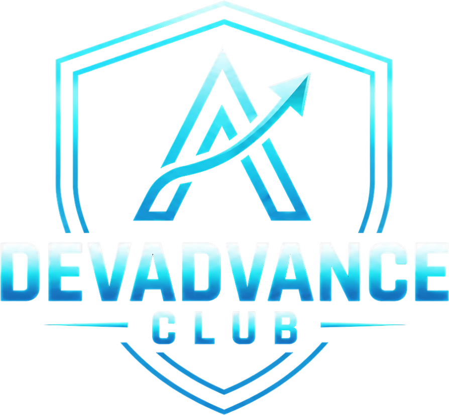

<div class="capa">

<p class="capa-kicker">DEVADVANCE CLUB · EBOOK</p>
<h1 class="capa-titulo">Guia de entrevista para desenvolvedores</h1>
<p class="capa-sub">O processo que eu usaria hoje para conseguir uma vaga em tecnologia</p>
<p class="capa-autor">Martin Fabichak · DEVADVANCE CLUB</p>
</div>

# Quem sou eu


Oi! Meu nome é Martin eu comecei a programar ainda adolescente, fazendo animação em Flash e scripts em ActionScript. Depois vieram uns scripts para servidores de Ultima Online, que eram basicamente a minha desculpa para jogar mais. Entrei em Matemática Aplicada e Computacional no IME-USP, me formei com honra ao mérito em 2009 e, no meio do caminho, já estava trabalhando com PHP, HTML e jogos de propaganda, desde 2007. Não tinha Git. Não tinha CSS.

Os jogos me levaram a programar C++ para multiplayer, e rede virou a coisa que eu sei fazer melhor, até hoje. Me tornei sócio e diretor técnico da Insolita Studios em 2008, e fizemos o primeiro jogo de PSP da América Latina (Freekscape: Escape from hell), um jogo multiplayer de futebol para a Globo e o jogo da Turma do Chico Bento no Facebook e no Orkut, que passou de 5 milhões de jogadores cadastrados e 20k CCU.

Em 2015 fui para a Alemanha. Liderei um time com gente do mundo inteiro (Polônia, Finlândia, Armênia, México, Bósnia etc.). Era backend que não escalava, bug que ninguém admitia ser bug, todo tipo de problema. Eu provei que o problema existia em outras equipes também, juntei três ou quatro times para fazer load test e resolvemos. Foi a primeira vez que percebi que o meu diferencial não era só técnico: era chegar com um plano, sentar para programar junto e convencer gente que não se reportava a mim, para alcançar meus objetivos. Foi lá também que eu conheci o Larry, o meu mentor, que mudou o rumo da minha carreira e da minha vida. Sem ele, eu não estaria escrevendo isso.

Na Chimera, em Munique, virei Head of Development aos 30. Reescrevi do zero a arquitetura do Monopoly Go, jogo 100% multiplayer, que depois rodou no mundo inteiro em soft-launch e trabalhei com a Rovio, Take-2 e Paradox.

E finalmente, em 2001 me tornei CTO na Magic Media, onde fiquei por quase cinco anos, a partir dos 34: vendi mais de 25 milhões de dólares em projetos, cheguei a liderar 160 engenheiros e mais de 20 projetos rodando ao mesmo tempo. E contratei mais de 100 pessoas.

É por isso que este ebook existe. Passei anos do lado de lá da mesa. Fiz centenas de entrevistas e vi gente boa sendo reprovada por motivos que tinham conserto. Mas eu já fui o candidato nervoso e hoje ajudo devs a cuidarem da carreira com intencionalidade, em vez de esperar ela acontecer.

# O DevAdvance Club

O DevAdvance Club é uma comunidade de devs que querem crescer na carreira com método. Dentro dele roda o **Programa ADVANCE**, a minha mentoria, que ensina o que nenhum outro curso ensina: soft skills, liderança e resolução de problemas.

O método tem quatro camadas:

1. **Técnico.** A base. Como tomar decisões técnicas e usar dados para influenciar o desenvolvimento.
2. **Liderança e soft skills.** Gestão: 1:1, feedback, delegação, contratação, e a parte que ninguém ensina: parar de se sabotar, comunicação.
3. **Resolução de problemas.** Métricas, KPIs, OKRs, crises, débito técnico, como tomar decisões por dado em vez de achismo e como convencer pessoas.
4. **Valorização.** Ser reconhecido e pago pelo valor que você já gera. É aqui que moram CV, LinkedIn, entrevistas e negociação, e é daqui que este ebook saiu.

Nas três camadas de baixo você cria valor. Na de cima, você captura esse valor.

Na prática, uma semana no programa é assim: um dia você faz um check-in rápido (o que fez, onde travou, o próximo passo), e eu respondo pessoalmente, em áudio ou texto, em 48h. Toda semana tem um encontro ao vivo com conteúdo e hot seats, que são 20-30 minutos inteiros em cima do problema real de alguém: a proposta, a promoção, o time que não entrega. Você também entra num pod de até seis pessoas com objetivo parecido, que se encontram quase toda semana e cobram uns aos outros. Terça e quinta tem office hours abertas pra conversar comigo. E tem mais de 60 aulas gravadas, a base teórica pra crescer na sua carreira.

O 1:1 comigo acontece nos momentos que decidem: no onboarding, quando a gente monta seu plano (meta de 12 meses, objetivo de 90 dias e tarefas a serem cumpridas), nos pods, na reunião semanal e nos office hours.

E pra terminar, temos nossa comunidade no Discord. Conversamos, trocamos vagas e dicas, e também aparecem outras oportunidades de ganhar dinheiro com a própria comunidade.

Conteúdo você encontra em qualquer lugar, inclusive neste ebook. O que muda carreira é direção, cobrança e alguém experiente olhando as suas decisões. Se fizer sentido para você, o endereço é **devadvance.club** ou fale comigo no WhatsApp: (12) 99785-8529

# Antes de tudo: três verdades sobre entrevista

Se você guardar só uma coisa deste ebook, que seja esta: **entrevista é uma habilidade, e habilidade se treina.** Não é um julgamento sobre o seu valor como pessoa, nem uma prova de que você "é bom" ou "é ruim". É uma conversa com formato previsível, e quem pratica esse formato vai melhor. Ponto.

A segunda verdade é que as entrevistas são muito mais parecidas entre si do que parecem. Muda a empresa, muda o sotaque do recrutador, mas as perguntas se repetem. "Me fala de você." "Por que você quer sair da sua empresa atual?" "Conta de um conflito." "Como você resolveria este problema?" Depois de dez entrevistas você vai notar que já ouviu quase tudo. Depois de vinte, vai ter resposta pronta para quase tudo.

A terceira é a mais difícil de engolir: **existe muito timing envolvido.** Você pode passar numa empresa numa semana e ser reprovado na seguinte. O orçamento do time foi congelado. O gestor saiu. Apareceu um candidato interno. O entrevistador dormiu mal. Nada disso tem a ver com você, e uma reprovação isolada não diz nada sobre a sua capacidade. Fica triste, é normal. Depois segue o jogo, prepara pra próxima.

Mas cuidado. "Foi timing" é uma explicação ótima para *uma* reprovação e uma desculpa péssima para *cinco reprovações na mesma etapa*. Se você cai sempre no teste técnico, não é timing. É o teste técnico. O resto do processo existe exatamente para separar o que é azar do que é padrão.

O processo tem seis passos:

1. Escolher a vaga alvo e entender o mercado
2. Mapear o que você sabe e o que falta
3. Fechar as lacunas que importam
4. Reescrever CV e LinkedIn
5. Se candidatar com volume e medir o funil
6. Fazer entrevistas, registrar resultados, revisar e repetir

# Passo 1: escolha o alvo e leia o mercado

Existem dois caminhos, e é bom você saber em qual está antes de começar.

**Caminho 1: uma vaga parecida com a que você já tem, ou um degrau acima.** Sua experiência atual é suficiente, ou quase. É o caminho mais curto, e é o que eu recomendo para a maioria das pessoas. Pleno indo para sênior, sênior indo para tech lead ou staff, dev de uma fintech indo para outra.

**Caminho 2: mudar de área.** Do front para o back, de agência para produto, de jogos para banco, de dev para dados. Dá, mas custa mais: além da tecnologia, você vai precisar aprender o contexto do negócio, e vai concorrer com gente que já tem esse contexto. Conta com mais tempo e mais entrevistas. Mas é possível sim.

Um aviso sobre o caminho 2: a mudança de área mais fácil que existe é **dentro da empresa onde você já está.** Lá você já tem reputação, e o gestor da outra área pode te testar sem risco. Antes de mandar currículo para fora, pergunta se isso é possível aí dentro.

## Descubra 10 a 20 vagas de verdade

Independente do caminho, o primeiro trabalho é de pesquisa. Entra no LinkedIn, no Gupy, no Programathor, no site de carreiras das empresas que você admira, e separa de 10 a 20 vagas que você gostaria de conseguir. Vagas próximas da sua experiência e, de preferência, um passo acima.

Salve cada uma como PDF ou .md (só o anúncio, sem o resto da página) e joga tudo numa LLM com o prompt do Anexo D. A ideia é descobrir o que o mercado está pedindo de fato para o cargo que você quer: o que aparece em quase todas as vagas, o que aparece em metade, e o que é enfeite.

E aqui vai uma coisa que muita gente não sabe: **anúncio de vaga é lista de desejos.** Quem escreveu pediu o candidato perfeito, sabendo que ele não existe. Se você cobre uns 70% do que é pedido e todos os itens que aparecem como obrigatórios em quase todas as vagas, se candidata. Esperar cumprir 100% é a forma mais comum de nunca se candidatar e esse candidato quase nunca existe.

# Passo 2: o que você tem e o que falta

Pega o resumo que a LLM gerou e monta uma tabela simples. Uma linha para cada requisito, e três colunas como no exemplo abaixo:

| Requisito | Frequência nas vagas | Onde eu estou |
|-|-|-|
| Node.js / TypeScript | 18 de 20 | Tenho: 4 anos em produção |
| AWS | 15 de 20 | Parcial: uso S3 e Lambda, nunca montei nada do zero |
| Mensageria (Kafka/SQS) | 11 de 20 | Não tenho |
| Liderança técnica | 9 de 20 | Tenho, mas nunca escrevi isso no CV |
| Kubernetes | 4 de 20 | Não tenho, e é pouco pedido |

Seja honesto na terceira coluna. "Já vi num tutorial" não é "tenho". Ter experiência em produção é o ideal. Se você não tem, pelo menos um teste/projeto no GitHub.

Com a tabela pronta, a decisão fica quase óbvia. O que você **tem** vai para o CV, com prova (Passo 4). O que você **não tem e aparece muito** vira plano de estudo (Passo 3). O que você não tem e aparece pouco, esquece por enquanto. Você não precisa de Kubernetes se só 4 de 20 vagas pedem.

Repara no item "liderança técnica" da tabela. Ele é o mais comum de todos: gente que *tem* a experiência e não fala dela. Muitas vezes a lacuna não está no seu conhecimento, está no seu currículo. E também temos que considerar que este é um termo razoavelmente abstrato.

# Passo 3: feche as lacunas que importam

## Lacuna técnica

Para um framework, um provedor de cloud (AWS/Azure), uma ferramenta que aparece em muitas vagas e você não domina, a versão enxuta é esta:

1. **Descubra os conceitos básicos da área.** Não tudo. Ninguém aprende React ou AWS inteiros sem ter colocado algo em produção. Mas toda tecnologia tem um núcleo que qualquer entrevistador espera que você saiba.
2. **Construa um projeto pequeno que resolva um problema de verdade.** Não um "hello world na AWS": uma API que recebe um arquivo, guarda no S3, processa numa fila e avisa quando terminou. Um projeto com uma decisão difícil dentro vale mais que cinco tutoriais repetidos. E coloque tudo no GitHub.
3. **Escreva um README muito bem explicado.** O que o projeto faz, como rodar, e principalmente *por que* você fez cada escolha e o que faria diferente com mais tempo. O README é onde você prova que entende.
4. **Explique o projeto em voz alta.** Grava um vídeo para pôr no README explicando o projeto, tecnicamente. O código pode até ter sido escrito com ajuda de uma LLM, tudo bem. Mas você precisa conseguir explicar cada linha e cada decisão, porque é exatamente isso que o entrevistador vai perguntar. Você não precisa passar por todas as linhas, mas é bom passar pela arquitetura e regras de negócio importantes. No geral: provar que você entende o CONCEITO por trás do framework.

Sobre GitHub: recrutador de RH raramente abre. Quem abre é o gestor técnico e ele vai olhar um ou dois repositórios, não vinte. Então é melhor ter dois projetos bons e fixados no perfil do que trinta forks e exercícios de curso.

E o ponto mais importante desta seção: **projeto pessoal não é experiência profissional, e você não deve apresentar como se fosse.** No CV, ele entra numa seção de projetos, com o nome certo. Na entrevista, você fala "não usei isso em produção, mas construí tal coisa e aprendi tal coisa". Essa frase honesta passa muito mais confiança do que um "sim, tenho experiência com Kafka" que desmorona na segunda pergunta.

## Certificação

Em algumas áreas, certificação pesa: nuvem, segurança, consultorias e empresas que vendem para governo. Descubra se é o seu caso olhando a sua tabela do Passo 2. Se as vagas pedem, tente fazer as certificações.

Mas cuidado com a certificação "mais fácil". A AWS Cloud Practitioner, por exemplo, é pensada para quem não é técnico. Para um dev, ela quase não diz nada. Se for tirar uma, mira no nível associate (AWS Developer ou Solutions Architect Associate, AZ-204 na Azure, Associate Cloud Engineer no Google). Dá mais trabalho, e é por isso que vale mais.

## Como descobrir o que é "básico"

YouTube e LLM ajudam a montar a primeira lista. Mas a melhor fonte é **gente que trabalha com aquilo, de preferência nas empresas onde você quer entrar.** Manda uma mensagem curta no LinkedIn, dizendo o que você está tentando aprender e pedindo 20 minutos de call ou umas perguntas por mensagem. Tem até um modelo no Anexo D.

A maioria dos devs responde. Nem todos, e tudo bem: manda para dez, conversa com três ou quatro. E presta atenção: essa conversa às vezes termina com a pessoa perguntando "quer que eu te indique?". **Indicação é, de longe, o canal que mais converte em contratação.** Nunca peça logo de cara. Mas também não finja que não quer.

## Lacuna de domínio (caminho 2)

Se você está mudando de área, a tecnologia é só metade. A outra metade é o negócio. Em banco, por exemplo: segurança, conciliação, diferença entre Pix, TED, boleto e cartão, o que é uma transação internacional, o que o Banco Central regula. Em saúde: prontuário, LGPD de dado sensível, integração com laboratório. Em jogos: game loop, rede, monetização, live ops.

O jeito de aprender é o mesmo: lista de conceitos, conversa com quem trabalha na área, e um projeto pequeno que use aquele vocabulário. Na entrevista, falar a língua do negócio é o que separa você do candidato que "sabe programar, mas nunca trabalhou com isso".

Isso também mostra proatividade e que você quer muito passar na vaga, o que conta MUITO.

# Passo 4: CV e LinkedIn

Não precisa terminar todos os projetos do Passo 3 para mexer no currículo. Começa agora, porque ele é o gargalo de quase todo mundo.

Três regras:

**1. Mostre o resultado, e deixe a tecnologia como contexto.** "Desenvolvi APIs em Node.js" é uma descrição de cargo. "Reduzi o tempo de resposta do checkout de 2,3s para 400ms reescrevendo as consultas em Node.js e adicionando cache em Redis" é uma conquista. A tecnologia continua lá, e precisa continuar, porque recrutador e ATS filtram por palavra-chave. Só que agora ela está servindo a um resultado.

**2. Abra o CV com um resumo das suas maiores conquistas.** Resumo no topo, dizendo quem você é, em que nível, e as duas ou três coisas que você fez que mais importam para a vaga. Muito recrutador decide nesses primeiros segundos se continua lendo.

**3. Mostre impacto e escopo.** Quanto você economizou, acelerou, destravou, vendeu. Quantas pessoas, quantos usuários, quantos times dependiam daquilo. Se você não tem o número exato, use uma estimativa honesta ("cerca de", "mais de"), e esteja pronto para explicar de onde ela veio e como foi mensurada. Número inventado é pior que nenhum número.

Use as palavras da sua tabela do Passo 2. Se 18 de 20 vagas pedem "TypeScript", a palavra "TypeScript" tem que estar no seu CV, e não só "JS/TS" perdido numa lista.

E faz uma versão levemente ajustada para cada *tipo* de vaga. Não para cada vaga: para cada tipo. Uma versão backend, uma versão tech lead, se você está mirando os dois. **Por isso, comece focando em UM tipo de vaga**.

No LinkedIn a lógica é a mesma, com mais espaço. O título não precisa ser só o cargo: "Tech Lead Backend · Node.js, AWS · pagamentos e sistemas de alta escala" aparece muito mais em busca de recrutador do que "Desenvolvedor na Empresa X". O "Sobre" pode contar a história em primeira pessoa. E liga o "aberto a oportunidades" para recrutadores (a opção privada, sem a moldura verde, se você está empregado).

Tem exemplos de antes e depois no Anexo A.

# Passo 5: candidatura com volume, e com método

Divida todas as vagas que achar para se candidatar em dois grupos:

- **Vagas de treino.** Empresas e vagas que você aceitaria, mas não são o sonho. Outra cidade, modelo híbrido, um segmento que você acha ok. É aqui que você erra as primeiras vezes, fica nervoso, descobre as perguntas que não sabe.
- **Vagas-alvo.** As empresas que você realmente quer. Você entra nelas depois de umas cinco ou seis entrevistas de treino, quando já está afiado. Deixe para depois.

Pode se candidatar sabendo que não vai aceitar? Pode. Não é perfeito, mas é bom pra treinar, e é necessário às vezes.

## Meça o funil

Monta uma planilha simples (modelo no Anexo E) e registra cada candidatura: empresa, vaga, data, canal (candidatura direta, recrutador, indicação) e até que etapa você chegou.

Parece burocracia mas não é. Essa planilha é o que vai te dizer, daqui a um mês, *onde* o seu processo está quebrado. E vamos usar isso pra treinar ainda mais o que está errado.

# Passo 6: entrevistar, registrar, revisar

## Antes

**Monte um banco de respostas, não um roteiro.** Decorar resposta palavra por palavra deixa a fala robótica, e entrevistador experiente percebe na hora. Em vez disso, escolhe de seis a oito histórias reais da sua carreira: um problema difícil que você resolveu, um conflito, um erro seu, uma entrega sob pressão, uma vez em que você liderou sem ter o cargo, uma decisão técnica que você defendeu. Com oito histórias bem contadas você responde praticamente qualquer pergunta comportamental, adaptando na hora.

**Treine em voz alta, e ouça a si mesmo.** Grave-se respondendo às perguntas do Anexo B no celular e ouve depois. Você vai perceber os "né", as respostas de quatro minutos, as histórias que não chegam no resultado. Melhor ainda: pede para alguém fazer uma entrevista simulada com você. (Num pod do DevAdvance, é o tipo de coisa que a gente faz toda semana.)

**Estude a empresa por meia hora.** O que ela vende, quem são os clientes, o que saiu na imprensa, quem vai te entrevistar (olha o LinkedIn da pessoa), olhe o Glassdoor e o perfil no Instagram. E prepare duas ou três perguntas para fazer no final. Tem sugestões no Anexo B.

**Arrume o ambiente.** Para empresa tradicional, como banco, uma camisa social resolve, sem precisar de terno. Para empresa de jogos ou startup, pode ser mais casual. Na dúvida, vista-se um pouco melhor que o time da empresa. Fundo limpo, sem gente nem bicho passando, luz na frente do rosto e não atrás. E testa câmera, microfone e internet dez minutos antes, não na hora.

## Durante

**Pense em voz alta nas perguntas técnicas.** O entrevistador está avaliando como você raciocina, não só se você chega na resposta. Silêncio de dois minutos seguido de uma resposta certa vale menos que um raciocínio visível que chega quase lá.

**Quando não souber, diga.** "Não sei, mas eu começaria olhando tal coisa" é uma resposta boa. Inventar é a pior resposta possível, porque o entrevistador quase sempre sabe mais que você sobre aquela pergunta específica.

**Se o entrevistador discordar de você**, não brigue e não se dobre. Pergunte o raciocínio dele, explique o seu uma vez, e siga. Depois da entrevista você vai pesquisar quem estava certo. E às vezes vai ser ele, às vezes você. Entrevistador também erra, e não é raro. Mas a entrevista não é o lugar para provar isso.

**Grave a entrevista**. No Brasil, gravar uma conversa da qual você participa em geral não é crime, mas muita empresa proíbe em política interna, e se descobrirem você sai do processo. Em outros países pode ser crime mesmo: na Alemanha e em alguns estados americanos, gravar sem consentimento dá processo. Então grave, e tenha certeza de que está seguro e ninguém mais vai ver. Vamos usar o transcript para depois da entrevista.

E uma coisa que precisa ser dita em 2026: **não use IA escondida durante a entrevista.** Ferramenta que "sopra" resposta em tempo real é detectável (o olhar desvia, o ritmo muda, a resposta vem perfeita demais e rasa demais), e quem é pego é eliminado e lembrado. Além de ser trapaça, ela te tira exatamente o treino que você foi buscar.

## Depois

**Nos primeiros dez minutos depois da call, despeje tudo.** Abre um app de ditado (Wispr Flow, o gravador do celular, qualquer um) e fala tudo o que você lembra: cada pergunta, o que você respondeu, onde travou, o que achou que foi bem. A memória some rápido. Se você gravou com permissão, transcreve o áudio.

**Joga isso num documento único de perguntas.** Uma LLM pode extrair as perguntas e classificar entre comportamentais e técnicas (prompt no Anexo D). Com o tempo, esse documento vira o seu material de estudo mais valioso, porque é feito das perguntas que o *seu* mercado faz, e não de lista genérica da internet.

Com o documento crescendo:

- Atualize depois de toda entrevista.
- Revise uma vez por semana.
- Estude os conceitos por trás das perguntas técnicas que você errou. Use a LLM para entender, mas escreva a resposta final com as suas palavras. Resposta com cara de ChatGPT soa como resposta com cara de ChatGPT.
- Treine em voz alta as perguntas que mais se repetem.

**Peça feedback quando for reprovado.** Responde o e-mail de reprovação agradecendo e pergunta, de forma curta, se a pessoa pode compartilhar um ou dois pontos para você melhorar. Se o processo foi longo e você teve boa relação com a recrutadora, pode perguntar se ela topa uma ligação de cinco minutos. Mas saiba que muita empresa não dá feedback detalhado por política (medo de processo), e insistir queima a relação. Pergunte uma vez. O que vier é lucro.

**Quando a proposta chegar, não responda na hora.** Agradeça, peça a proposta por escrito e um ou dois dias para avaliar. Quase toda proposta tem alguma margem, e a hora de negociar é antes de aceitar, nunca depois.

# Quando não está funcionando

Se você fez muitas entrevistas e não passou em nenhuma, a pergunta certa não é "o que tem de errado comigo?". É "**em que etapa eu estou caindo?**". Abre a planilha do funil.

| Onde você cai | O que provavelmente é | O que fazer |
|-|-|-|
| Se candidata e ninguém responde (menos de 1 retorno a cada 10 ou 15 candidaturas) | CV, LinkedIn ou vagas erradas para o seu nível | Refaça o Passo 4. Peça para alguém sênior ler seu CV. Busque indicação. Confira se não está mirando alto demais |
| Passa pelo RH e cai na primeira conversa | Comunicação, motivação mal explicada, pretensão salarial desalinhada | Grave as respostas do Anexo B e ouça. Revise o seu "por que quero sair" |
| Cai no técnico | Lacuna técnica real | Volte ao Passo 3, usando o seu documento de perguntas como mapa |
| Chega na final e não leva | Comparação com outro candidato, fit, senioridade percebida, ou timing | Peça feedback. Reforce histórias de impacto e liderança. Aqui o timing pesa de verdade |

Uma regra de bolso: se você chegou a umas **10 entrevistas de verdade** (não candidaturas, entrevistas) e continua caindo na mesma etapa, algo precisa mudar. As opções são:

- Aprofundar a parte técnica, com projetos mais completos e revisando os que você já tem.
- Mirar em outro segmento, onde o seu perfil é mais raro.
- Descer um degrau. Tentar pleno em vez de sênior, por exemplo. Isso não é fracasso. Entrar um nível abaixo numa empresa melhor, e subir lá dentro em um ano, é uma das jogadas de carreira mais subestimadas e é ótimo.

E se você não sabe dizer em que etapa está caindo, é porque não fez a planilha. **Faça a planilha.**

# Próximo passo

Este ebook é o processo. Ele funciona se você fizer, e a parte difícil nunca foi saber o que fazer: é continuar fazendo na décima reprovação, quando dá vontade de largar tudo.

É para isso que existe o Programa ADVANCE. Check-in toda semana, alguém que já contratou mais de 100 pessoas olhando o seu CV e as suas respostas, um pod de gente passando pela mesma coisa, e hot seats onde a gente simula a entrevista antes da entrevista.

Se quiser conversar, me chama em **devadvance.club** ou no WhatsApp: (12) 99785-8529

Boa entrevista. E lembra: é treino. Você pode, você merece.

# Anexo A · Currículo: antes e depois

A regra de todos os exemplos é a mesma: **verbo de ação + o que você fez + resultado com número + tecnologia como contexto.** Os números abaixo são exemplos. Use os seus.

## Resumo do topo

**Antes**

> Desenvolvedor Full Stack com 6 anos de experiência, proativo, apaixonado por tecnologia e com facilidade para trabalhar em equipe. Conhecimentos em React, Node.js, AWS, Docker, SQL e metodologias ágeis.

Qualquer pessoa pode escrever isso. "Proativo" e "apaixonado" não provam nada, e a lista de tecnologias não diz o que você fez com elas.

**Depois**

> Desenvolvedor sênior com 6 anos em produtos de pagamento, os últimos 2 como referência técnica de um time de 5 pessoas. Liderei a migração do monolito de cobrança para serviços em Node.js na AWS, reduzindo incidentes em produção em 60%. Experiência com sistemas de alto volume (2 milhões de transações por mês), React e TypeScript.

## Experiência: backend

**Antes:** Desenvolvimento e manutenção de APIs REST em Node.js.

**Depois:** Reescrevi as consultas e adicionei cache em Redis nas APIs de checkout, reduzindo o tempo de resposta de 2,3s para 400ms e a taxa de abandono em 8%.

**Antes:** Responsável pela integração com gateways de pagamento.

**Depois:** Integrei 3 gateways de pagamento com fallback automático entre eles, o que eliminou as quedas de checkout quando um provedor saía do ar (antes, cerca de 4 por mês).

## Experiência: frontend

**Antes:** Desenvolvimento de telas em React seguindo o design system.

**Depois:** Criei 40 componentes do design system em React e TypeScript, hoje usados por 4 times, o que cortou pela metade o tempo de entrega de telas novas.

**Antes:** Melhorias de performance no site.

**Depois:** Reduzi o LCP da página de produto de 4,1s para 1,8s com lazy loading e divisão de bundle, o que acompanhou um aumento de 12% na conversão mobile.

## Experiência: infra e qualidade

**Antes:** Configuração de pipelines de CI/CD.

**Depois:** Montei o pipeline de CI/CD no GitHub Actions com testes automatizados e deploy por branch, levando os deploys de 1 por semana (manual, às sextas) para 10 por dia.

**Antes:** Escrita de testes unitários.

**Depois:** Subi a cobertura de testes do módulo de faturamento de 15% para 70%, e os bugs de faturamento reportados por clientes caíram de 20 para 3 por trimestre.

## Experiência: liderança

**Antes:** Tech lead de um time de desenvolvimento.

**Depois:** Tech lead de 6 devs. Implantei 1:1 quinzenal e revisão de código por pares; em 12 meses, 2 pessoas do time foram promovidas e ninguém pediu demissão.

**Antes:** Participação em processos seletivos.

**Depois:** Redesenhei a entrevista técnica do time (de teste teórico para pair programming com problema real), entrevistei mais de 40 candidatos e contratei 5, todos aprovados no período de experiência.

## Projeto pessoal (sem fingir que é experiência)

**Antes:** Conhecimento em AWS e mensageria.

**Depois (na seção Projetos):** *Processador de notas fiscais.* API em Node.js que recebe XMLs, enfileira no SQS e processa com Lambda, com retentativa e fila de erros. README com as decisões de arquitetura e os custos estimados. github.com/seu-usuario/processador-nf

## Se você não tem números

Nem todo mundo tem acesso a métricas, principalmente em início de carreira. Nesse caso, mostre **escopo** e **consequência**:

- Quem usava o que você fez? ("usado diariamente por 30 atendentes")
- O que deixou de acontecer? ("acabou com a planilha manual de conciliação")
- Quanto tempo economizou, mesmo estimado? ("cerca de 5 horas por semana do time financeiro")
- Quem pediu, e para quê? ("pedido pela diretoria para a auditoria anual")

## LinkedIn

**Título, antes:** Desenvolvedor na Empresa X

**Título, depois:** Desenvolvedor Backend Sênior · Node.js, TypeScript, AWS · Pagamentos e sistemas de alto volume

**"Sobre", depois (exemplo):**

> Trabalho há seis anos com sistemas de pagamento. Gosto do tipo de problema em que um erro custa dinheiro de verdade, e por isso gosto de teste, de observabilidade e de deploy pequeno.
>
> Na Empresa X, liderei a migração do sistema de cobrança para serviços na AWS e ajudei o time a sair de um deploy por semana para dez por dia. Hoje sou a referência técnica de um time de cinco pessoas.
>
> Quero continuar em produto financeiro, de preferência num papel com mais liderança técnica. Se você trabalha com isso, me chama para conversar.

# Anexo B · Perguntas de RH e comportamentais

Para cada pergunta: o que o entrevistador quer descobrir de verdade, e como responder. **Não decore frases.** Use as suas histórias (o banco de 6 a 8 histórias do Passo 6) e adapte.

## As que aparecem em quase toda entrevista

**"Me fala um pouco sobre você."**
Querem ver se você consegue se apresentar de forma organizada, e se o seu perfil bate com a vaga. Responda em até três minutos: quem você é profissionalmente hoje, uma ou duas conquistas relevantes para a vaga, e por que você está conversando com eles. Não conte a vida desde a faculdade. Foque no que é relevante.

**"Por que você quer sair do seu emprego atual?"** (ou "por que saiu?")
Querem saber se você é problema e se vai sair deles também. Fale do que você está *buscando*, não do que está fugindo. "Quero trabalhar com sistemas de maior escala, e lá o produto estabilizou" é boa. "Meu chefe é péssimo" é ruim, mesmo que seja verdade. Se foi demitido num layoff, diga isso direto; é comum e ninguém julga.

**"Por que essa empresa?"**
Querem saber se você pesquisou ou está atirando para todo lado. Cite algo específico: o produto, um desafio técnico que eles descreveram, um post do blog de engenharia, alguém que trabalha lá e falou bem.

**"Quais são seus pontos fortes?"**
Um ou dois, com prova. "Sou bom em destravar problemas entre times: na Empresa X, eu..." vale mais que cinco adjetivos.

**"E seus pontos fracos?"**
Querem ver autoconhecimento. Escolha uma fraqueza real, que não seja central para a vaga, e mostre o que você está fazendo sobre ela. Fuja do clichê "sou perfeccionista". Todo recrutador já ouviu mil vezes.

**"Onde você se vê em cinco anos?"**
Querem saber se a vaga faz sentido no seu plano e se você vai ficar. Fale de direção (mais liderança técnica, mais profundidade em tal área), não de cargo exato. E não diga "no seu lugar".

**"Qual a sua pretensão salarial?"**
Querem saber se você cabe no orçamento. Pesquise antes (Glassdoor, levels.fyi, conversas com gente da área) e tenha uma **faixa**. Se possível, pergunte primeiro: "Qual é a faixa prevista para a vaga?". Se insistirem, dê a faixa e deixe claro que depende do pacote todo (benefícios, bônus, modelo de contratação CLT ou PJ). Nunca diga um número que você não aceitaria.

**"Por que devemos te contratar?"**
Resuma em três frases a ligação entre o que a vaga pede e o que você já provou que faz. É basicamente o seu resumo do topo do CV, dito em voz alta. Demonstre também interesse e motivação para crescer.

**"Você tem alguma pergunta?"**
Sempre tenha. Não ter pergunta soa como falta de interesse. Sugestões mais abaixo.

## Outras perguntas comportamentais

- "Conta de uma vez que você discordou do seu gestor ou de um colega. O que aconteceu?"
- "Conta de um erro que você cometeu em produção."
- "Conta de um projeto que atrasou ou deu errado. O que você aprendeu?"
- "Conta de uma vez em que você teve que entregar com prazo apertado."
- "Conta de uma situação com um colega difícil."
- "Conta de uma vez em que você teve que aprender algo novo muito rápido."
- "Conta de uma decisão técnica que você tomou e depois se arrependeu."
- "Conta de uma vez que você influenciou uma decisão sem ter autoridade formal."
- "Como você lida com prioridade que muda toda semana?"
- "Conta de um feedback difícil que você recebeu. O que fez com ele?"

**Para quem mira liderança**, some estas:

- "Conta de uma vez em que você deu um feedback difícil."
- "Como você lida com alguém do time que não está entregando?"
- "Como você decide o que o time faz agora e o que fica para depois?"
- "Como você equilibra débito técnico e entrega de funcionalidade?"
- "Conta de uma contratação que deu errado."
- "Como você explica um atraso para alguém de negócio?"

## Um exemplo de resposta

**"Conta de um erro que você cometeu em produção."**

> Na Empresa X, eu fiz o deploy de uma mudança no cálculo de frete numa sexta à tarde. Era uma correção pequena, e eu testei só o caso que estava quebrado. Em uma hora começaram a chegar tickets de frete zerado para o Nordeste. Eu fiz o rollback, avisei o time de atendimento e, na segunda, escrevi um post-mortem com a causa: não tinha teste para as faixas de CEP. Adicionei os testes e propus a regra de não fazer deploy de cálculo financeiro na sexta. O prejuízo foi de uns 3 mil reais em frete não cobrado, a regra virou padrão do time e nunca mais tivemos incidente de frete.

Repare: tem número, tem responsabilidade assumida, e o foco está no que mudou depois.

## Perguntas para você fazer no final

- "Como é um dia normal de quem ocupa essa vaga?"
- "Qual o maior desafio técnico do time hoje?"
- "Como vocês medem se alguém nessa posição está indo bem depois de seis meses?"
- "Por que essa vaga está aberta? É reposição ou crescimento?"
- "Como funciona o processo de promoção aqui?"
- "O que você mais gosta e o que menos gosta de trabalhar aqui?" (para o gestor ou alguém do time)
- "Quais são os próximos passos do processo?"

# Anexo C · Perguntas técnicas mais comuns

Esta lista é um ponto de partida. O seu documento de perguntas, construído a partir das suas próprias entrevistas, vai ser mais útil que ela em poucas semanas. Use-a para saber o que estudar antes da primeira.

## Como responder uma pergunta técnica

1. **Repita a pergunta com as suas palavras** e confirme que entendeu. Metade das respostas ruins é resposta certa para a pergunta errada.
2. **Pergunte as restrições.** Quantos usuários? Precisa ser em tempo real? Pode perder dado?
3. **Comece simples**, e só depois melhore. "A versão mais simples seria X. O problema dela é Y. Então eu faria Z."
4. **Fale dos trade-offs.** Quase toda pergunta de sênior para cima é, no fundo, uma pergunta sobre trade-offs.
5. **Diga quando não sabe**, mas fale como descobriria.

## Fundamentos (todo nível)

- Qual a diferença entre processo e thread? E entre concorrência e paralelismo?
- O que acontece quando você digita uma URL no navegador e aperta Enter?
- Qual a diferença entre HTTP e HTTPS? O que é TLS, por alto?
- Quais os métodos HTTP e quando usar cada um? O que é idempotência?
- O que é complexidade de algoritmo (Big O)? Qual a complexidade de buscar num array e num hash map?
- O que é Git rebase e qual a diferença para merge?
- Explique os princípios SOLID com um exemplo real seu.
- O que é injeção de dependência e por que ela ajuda a testar?

## Backend

- REST, GraphQL, gRPC: quando usar cada um?
- Como você versiona uma API sem quebrar os clientes?
- Como funciona autenticação com JWT? Onde guardar o token? Quais os riscos?
- Diferença entre autenticação e autorização.
- O que é uma fila de mensagens e quando ela faz sentido? O que acontece quando uma mensagem é processada duas vezes?
- Como você implementaria rate limiting?
- O que é cache? Quais as estratégias de invalidação? Onde colocaria cache numa API lenta?
- Como você garante que um pagamento não seja cobrado duas vezes?
- Como você lida com uma chamada para um serviço externo que às vezes demora 30 segundos?

## Frontend

- Como funciona o ciclo de renderização no React? O que causa re-render desnecessário?
- Estado local, contexto, ou uma biblioteca de estado: como você decide?
- Diferença entre renderização no cliente, no servidor (SSR) e estática (SSG).
- Como você mede e melhora a performance de uma página? O que são Core Web Vitals?
- O que é o event loop do JavaScript? Diferença entre microtask e macrotask.
- O que são CORS, XSS e CSRF, e como se proteger?
- Como você garante acessibilidade básica numa tela?

## Banco de dados

- SQL ou NoSQL: como você escolhe?
- O que é um índice? Quando ele atrapalha?
- O que é uma transação? O que significa ACID?
- O que é o problema N+1 e como resolver?
- Como você investigaria uma consulta lenta em produção?
- Normalização: o que é, e quando desnormalizar?
- Como fazer uma migração de schema numa tabela grande sem derrubar o sistema?

## Cloud, DevOps e observabilidade

- O que um pipeline de CI/CD deve ter, no mínimo?
- Diferença entre container e máquina virtual. O que o Docker resolve?
- O que é infraestrutura como código? Já usou Terraform ou algo parecido?
- Blue-green, canary e rolling deploy: diferenças.
- Logs, métricas e traces: para que serve cada um?
- O sistema está lento e ninguém sabe por quê. Por onde você começa?
- Como você reduziria o custo de nuvem de um sistema que está caro demais?

## Testes e qualidade

- Pirâmide de testes: unitário, integração, ponta a ponta. Quanto de cada?
- O que é um bom teste? O que torna um teste frágil?
- TDD: usa? Quando faz sentido e quando não faz?
- Como você revisa um pull request? O que você procura primeiro?

## Design de sistemas

Aqui não existe resposta certa, e o entrevistador quer ver o seu processo: requisitos, estimativa de volume, desenho simples, gargalos, e evolução.

- Desenhe um encurtador de URL.
- Desenhe um sistema de notificações (e-mail, push, SMS) para milhões de usuários.
- Desenhe o backend de um chat.
- Desenhe um sistema de pagamentos com retentativa.
- Como você faria um feed como o do Instagram?
- Como escalar um sistema que hoje roda num único servidor e começou a cair nos horários de pico?

## Live coding

Os clássicos continuam aparecendo, principalmente em empresa grande: manipulação de string e array, hash map, dois ponteiros, árvore e grafo básico (busca em largura e profundidade). Faça uns 30 ou 40 exercícios fáceis e médios no LeetCode ou no NeetCode, sempre falando em voz alta. Mais que isso raramente compensa, a não ser que você mire em big tech.

Cada vez mais empresas trocam o algoritmo por um problema prático: "aqui está um repositório pequeno com um bug, conserte" ou "adicione esta funcionalidade". Nesse formato, contam ler código dos outros, fazer perguntas e escrever teste.

## IA no dia a dia (2026)

Essas perguntas já são comuns e vão ficar mais:

- Como você usa ferramentas de IA para programar? Onde elas ajudam e onde atrapalham?
- Como você revisa código gerado por IA?
- Como você evita que dado sensível da empresa vá parar numa ferramenta externa?
- Já integrou um modelo de linguagem num produto? Como lidou com custo, latência e respostas erradas?

## Para quem mira tech lead

- Como você decide entre reescrever um sistema ou refatorar aos poucos?
- Como você convence o produto a priorizar débito técnico?
- Como você conduz uma decisão técnica em que o time está dividido?
- Como você faz um novo dev ser produtivo nas primeiras duas semanas?
- Como você estima um projeto grande? E o que faz quando a estimativa estoura?
- Quais métricas você acompanha para saber se o time está bem?

# Anexo D · Prompts prontos

Copie, cole e ajuste. Funcionam em qualquer LLM boa (Claude, ChatGPT, Gemini).

## 1. Análise das vagas (Passo 1)

Anexe os 10 a 20 PDFs e use:

```
Anexei todos os anúncios de vaga para [cargo], nível [nível] na pasta [pasta].
Quero entender o que o mercado está pedindo para esse cargo.

1. Liste todos os requisitos técnicos e comportamentais que aparecem.
   Para cada um, diga em quantas vagas aparece (ex.: 14 de 20).
2. Separe em três grupos:
   - obrigatórios de fato (aparecem em 70% ou mais, ou marcados como obrigatórios)
   - diferenciais frequentes (entre 30% e 70%)
   - raros (menos de 30%)
3. Liste as palavras e expressões exatas que mais se repetem
   (vou usar no meu currículo).
4. Resuma em um parágrafo o perfil que essas empresas parecem buscar.
5. Aponte padrões por tipo de empresa, se houver
   (startup vs. grande empresa, por exemplo).

Seja literal: não invente requisito que não está nas vagas.
```

## 2. O que eu tenho e o que falta (Passo 2)

```
Abaixo está a análise das vagas e o meu currículo.

[cole a análise]
[cole o currículo]

Monte uma tabela com: requisito | frequência nas vagas |
o que o meu currículo mostra sobre isso (cite o trecho) |
classificação (tenho e está no CV / tenho mas não está no CV /
parcial / não tenho).

Depois, me faça perguntas sobre os itens "parcial" e "não tenho",
porque eu posso ter experiência que não coloquei no CV.
Não suponha que eu tenho algo só porque é comum ter.
```

## 3. Reescrever um item do currículo (Passo 4)

```
Reescreva este item do meu currículo no formato:
verbo de ação + o que fiz + resultado com número + tecnologia como contexto.

Item: "[cole o item]"

Antes de reescrever, me faça as perguntas que precisar para
descobrir o resultado real (números, escopo, quem usava, o que mudou).
Não invente números. Se eu não souber o número, sugira como
estimar de forma honesta ou use escopo em vez de número.
Use estas palavras-chave, se fizer sentido: [lista do prompt 1].
```

**Atenção:** use isto para ter uma IDEIA do que escrever. Não copie e cole. Escreva você mesmo no seu CV.


## 4. Extrair perguntas de uma entrevista (Passo 6)

```
Abaixo está a transcrição de uma entrevista
para [cargo] na [empresa], etapa [RH / técnica / final].

[cole o texto]

1. Liste todas as perguntas que me fizeram, com as palavras mais
   próximas possíveis das originais.
2. Classifique cada uma: comportamental, técnica (diga a área),
   ou sobre a empresa/vaga.
3. Para cada uma, diga em uma linha como foi a minha resposta
   (boa, incompleta, errada, fugi da pergunta) e por quê.
4. Liste os conceitos técnicos que eu devo estudar por causa dessa entrevista.

Formate para eu colar no meu documento de perguntas.
```

## 5. Entrevista simulada

```
Você é [cargo do entrevistador, ex.: tech lead] na [tipo de empresa],
entrevistando para a vaga abaixo.

[cole a vaga]

Faça uma pergunta por vez e espere a minha resposta.
Misture perguntas comportamentais e técnicas, como numa entrevista real
de 45 minutos. Se a minha resposta for vaga, aprofunde como um
entrevistador de verdade faria.
No final, me dê um feedback duro: onde eu fui bem, onde fui mal,
e se você me passaria para a próxima etapa. Não seja gentil demais.
```

<div class="junto" markdown="1">

## 6. Mensagem para pedir conversa no LinkedIn

Isso não é prompt, é modelo. Curta, específica, e fácil de dizer sim:

```
Oi, [nome]! Vi que você trabalha com [tecnologia/área] na [empresa].
Estou me preparando para vagas de [cargo] e queria entender
o que é essencial saber para começar em [tecnologia/área].
Você toparia 20 minutos de conversa nas próximas semanas,
ou responder umas 3 perguntas por aqui mesmo? Se não der, sem problema.
Obrigado!
```

</div>

# Anexo E · Planilha do funil

| Empresa | Vaga | Tipo | Canal | Data | Etapa alcançada | Resultado | Motivo / feedback |
|-|-|-|-|-|-|-|-|
| Empresa A | Backend Sênior | Treino | Candidatura direta | 02/10 | RH | Reprovado | "Buscando mais experiência com Kafka" |
| Empresa B | Tech Lead | Alvo | Indicação | 05/10 | Técnica | Em andamento | |
| Empresa C | Backend Sênior | Treino | Recrutador | 06/10 | Sem resposta | | |

**Etapas:** Sem resposta → RH → Técnica → Final → Proposta.

Uma vez por semana, conte:

- Quantas candidaturas você mandou.
- Quantas viraram primeira conversa (taxa de resposta).
- Em que etapa cada processo parou.
- Qual canal está convertendo melhor (quase sempre é indicação).

Com três ou quatro semanas de dados, a tabela da seção "Quando não está funcionando" deixa de ser teoria e vira diagnóstico.
